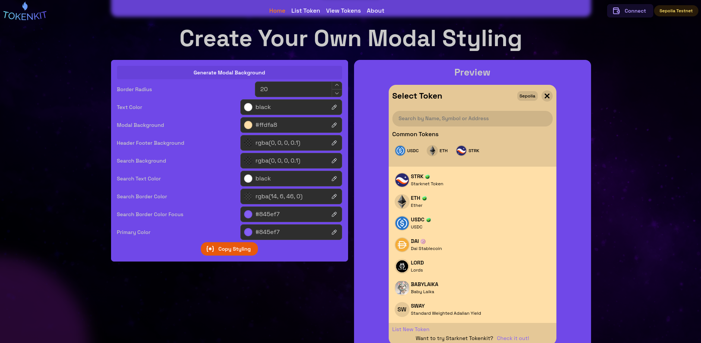

# Select Token Container

## Embedding the container in a page

Select token container allows to embed the modal in a page. This can be used in instances that you don't intend to use a modal.

For this case, an example usage is what we have used above where we create a theme for our modal.

```tsx
<SelectTokenContainer
    selectedToken={SelectedToken} // Pass a selected token as when creating a modal
    callBackFunc={setSelectedToken} // Pass a call back function that will update the selected token
    animation={'fade'} // Optional - Default 'fade', Options: 'bounce' | 'slide' | 'ease' | 'fade'
    modalHeight="500px"  // Always pass the height to override the default 90dvh
/>
```

## Example on Tokenkit Landing page




