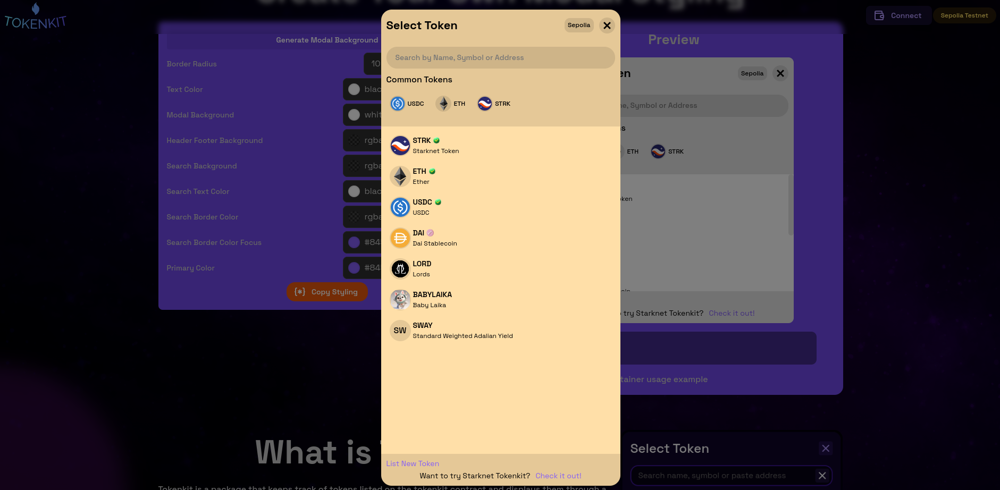

# Using Tokens Modal

## Usage on a given Page

Finally, use the `SelectToken` component in one of your pages. Import the component and render it.

```tsx
import SelectToken from './SelectToken'

const SwapPage = () => {

    return (
        <div>
            <SelectToken />
        </div>
    )
}
```



:::note

You have just learned the **basics of Tokenkit**.
TokenKit has **much more to offer**! Stay tuned for future updates 

Anything **unclear** or **buggy** in this documentation? [Please report it!] our telegram and X hanldes are always open for positive vibes and assistance  to the community and tokenkit users 

:::tip
The above usage is more of a simple use case, look at the next section where we help you develop a reusable token modal component
:::


